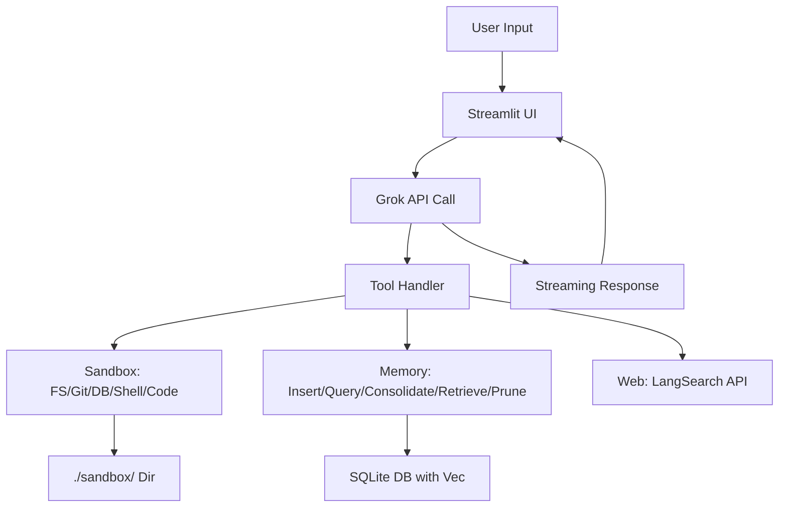

# HomeBot


[](https://www.python.org/downloads/release/python-3120/)  
[](https://opensource.org/licenses/MIT)  
[](https://github.com/buckster123/HomeBot)  
[](https://x.ai/)  

  

**HomeBot** is a self-hosted, agentic AI assistant platform built for Raspberry Pi 5 (Pi-5), leveraging xAI's Grok models via Streamlit. It's designed as a local, sandboxed AI agent hub for home automation, coding experiments, research, and personal productivity. Think of it as your personal JARVIS, but running on a credit-card-sized computer with brain-inspired memory (EAMS: Episodic-Advanced Memory System), tool integrations for file ops, Git, DB queries, code linting/execution, and web search—all while emphasizing safety, persistence, and nerd-level customizability.

This README is a **deep dive for devs and tinkerers**: We'll dissect the architecture, tool ecosystem, memory hierarchy, and agentic workflows. For the retail pitch? Skip to the install guide. 🚀

> **Nerd Alert**: HomeBot uses a hybrid memory system with embeddings for semantic recall, stateful REPL for code execution, and agent delegation (Main → Coding/Research/Management sub-agents). It's Pi-optimized for low-power, always-on operation. No cloud dependencies beyond optional xAI API (self-hostable alternatives possible).

## Table of Contents
- [Features](#features)
- [Architecture Deep Dive](#architecture-deep-dive)
- [Agentic Workflow](#agentic-workflow)
- [Tools Ecosystem](#tools-ecosystem)
- [Memory System (EAMS)](#memory-system-eams)
- [Installation Guide](#installation-guide)
- [Usage](#usage)
- [Configuration](#configuration)
- [Contributing](#contributing)
- [Troubleshooting](#troubleshooting)
- [License](#license)

## Features
HomeBot isn't just a chat app—it's an extensible AI agent platform. Key highlights:

- **Agentic AI Core**: Powered by xAI Grok (models like grok-4, grok-3), with prompt engineering for tool-aware reasoning. Supports Chain-of-Thought (CoT), Tree-of-Thoughts (ToT), and sub-agent delegation.
- **Sandboxed Tools**: File I/O, Git ops, code execution/linting, DB queries, shell commands, API simulation, and web search—all confined to `./sandbox/` for security.
- **Brain-Inspired Memory**: Hierarchical EAMS with embeddings (via sentence-transformers), salience decay, and pruning. Store episodic details, semantic summaries, and retrieve via similarity search.
- **Vision Support**: Upload images for analysis (e.g., object detection via Grok-vision-compatible models).
- **UI Polish**: Neon-gradient theme, chat bubbles, dark mode toggle, history search. Responsive for Pi touchscreen or remote access.
- **Persistence**: SQLite for users/history/memory, with WAL mode for concurrency. Auto-prunes low-salience memories.
- **Extensibility**: Custom prompts in `./prompts/`, dynamic loading. Add tools via schema updates.
- **Pi-5 Optimizations**: Low-RAM embedding model (`all-MiniLM-L6-v2`), stateful REPL to avoid reloads, NTP sync for accurate timing.

| Feature | Nerd Details | Why It Pops |
|---------|--------------|------------|
| **Tool Chaining** | Batch tools in loops (e.g., `fs_mkdir` → `fs_write_file` → `git_ops(commit)`). Max 3 iterations to prevent loops. | Enables autonomous workflows like "Build and version a ML model." |
| **Memory Hierarchy** | Episodic (raw data) → Semantic (Grok-summarized) with parent-child links. Embeddings via NumPy/SQLite-vec. | Mimics human recall: Fast semantic search, decay for forgetting irrelevants. |
| **Code REPL** | Stateful Python 3.12 with libs (numpy, torch, sympy, etc.). No internet/pip. | Iterate code without restarts—perfect for Pi's limited resources. |
| **Web Search** | LangSearch API integration: Freshness filters, summaries, up to 10 results. | Real-time knowledge without bloating the app. |

## Architecture Deep Dive
HomeBot is a Streamlit single-file app (`app.py`) with modular components:

- **Frontend**: Streamlit for UI (chat, sidebar settings, file uploads). Custom CSS for neon gradients, bubbles, and dark mode.
- **Backend**: OpenAI SDK for xAI API calls (streaming, tools). SQLite for DB (users, history, memory with vec extension).
- **Tools Layer**: Sandboxed functions (e.g., `fs_read_file`) invoked via Grok's tool calls. Batch-processed to avoid loops.
- **Memory Layer**: Hybrid DB with timestamps, embeddings, salience. Cache in session_state for speed.
- **Prompt System**: Dynamic loading from `./prompts/`. Defaults include "default", "coder", "tools-enabled".
- **Dependencies**: See `requirements.txt` below. Pi-5 arm64-compatible (e.g., pre-built wheels for torch/sentence-transformers).



**Code Structure**:
- Imports & Env: Load .env (XAI_API_KEY, LANGSEARCH_API_KEY).
- DB Setup: SQLite with WAL, vec extension for embeddings.
- Prompts & Sandbox: Auto-create defaults, mkdir.
- Tools: Functions + schema for Grok.
- API Wrapper: Streaming with tool chaining, error retries.
- Pages: Login/Register + Chat (history, settings).

Total LoC: ~800. Emphasis on error handling (try-except everywhere) and logging.

## Agentic Workflow
HomeBot follows a ReAct-style loop (Reason + Act) with delegation:

1. **Main Agent**: Decomposes queries (CoT/ToT), delegates if specialized (e.g., "Switch to Coding Sub-Agent").
2. **Sub-Agents**:
   - **Coding**: Plans code dev (to-do lists), uses lint/execute/git.
   - **Research**: Web search + analysis, integrates memory.
   - **Management**: Prunes, organizes, backups.
3. **Iteration**: Self-check, limit 3-5 cycles. Persist via memory/FS.
4. **Output**: Structured: Analysis → Reflection → Final Answer.

Example: "Code a snake game" → Delegate to Coding → Plan steps → Tool batch (mkdir, write_file, lint, execute) → Commit → Return.

## Tools Ecosystem
All tools sandboxed to `./sandbox/`. Schema-defined for Grok.

| Tool | Description | Use Case |
|------|-------------|----------|
| `fs_*` | Read/write/list/mkdir files. | Project scaffolding. |
| `get_current_time` | NTP-synced time. | Timestamps. |
| `code_execution` | Stateful Python REPL. | Testing/simulations. |
| `memory_*` | KV + advanced semantic ops. | Persistence/recall. |
| `git_ops` | Init/commit/branch/diff. | Versioning. |
| `db_query` | SQLite interactions. | Data mgmt. |
| `shell_exec` | Whitelisted commands (ls/grep). | Utils. |
| `code_lint` | Multi-lang formatting. | Clean code. |
| `api_simulate` | Mock/real API calls. | Integrations. |
| `langsearch_web_search` | Web search with filters. | Research. |

Rules: Batch calls, error-handle, limit iterations.

## Memory System (EAMS)
Episodic-Advanced Memory System: Brain-mimicking storage.

- **Structure**: User/convo-linked, with embeddings (SentenceTransformer), salience (decay 0.99/week), hierarchy (parent summaries).
- **Ops**: Insert/query + consolidate (Grok summarize + embed), retrieve (cosine sim), prune (<0.1 salience).
- **Master Index**: 'eams_index' for overview.
- **Efficiency**: Cache hits first, FS links for large data.

Example: Consolidate chat log → Semantic summary as parent, raw as child → Retrieve via query sim.

## Installation Guide
Full step-by-step for **fresh Raspberry Pi 5** with **fresh Raspberry Pi OS** (64-bit, Bookworm or later). Assumes HDMI/keyboard setup or headless SSH.

### Prerequisites
- Raspberry Pi 5 (4GB+ RAM recommended).
- MicroSD card (16GB+).
- Power supply, Ethernet/WiFi.
- xAI API key (from x.ai).
- Optional: LangSearch API key for web search.

### Step 1: Flash OS
1. Download [Raspberry Pi Imager](https://www.raspberrypi.com/software/).
2. Insert SD card into your computer.
3. Select Raspberry Pi OS (64-bit), your SD card, and flash.
4. Eject SD, insert into Pi-5, boot up.
5. Complete setup wizard: Set locale, user (e.g., `pi`), password, WiFi.

### Step 2 A: Automatic Installation
 - Run install.sh and proceed to Step 7

### Or...

### Step 2 B: Update System & Install Python

SSH in or use terminal:
```bash
sudo apt update && sudo apt upgrade -y
sudo apt install python3 python3-pip python3-venv git build-essential libatlas-base-dev libsqlite3-dev -y
```

### Step 3: Clone Repo
```bash
git clone https://github.com/buckster123/HomeBot.git
cd HomeBot
```

### Step 4: Set Up Virtual Env & Install Deps
Create `requirements.txt`:
```
streamlit==1.38.0
openai==1.40.0
passlib==1.7.4
python-dotenv==1.0.1
ntplib==0.4.0
pygit2==1.15.0
requests==2.32.3
black==24.8.0
numpy==2.0.1
sentence-transformers==3.0.1
torch==2.4.0  # Use --extra-index-url https://download.pytorch.org/whl/cpu for Pi (CPU-only)
jsbeautifier==1.15.1
cssbeautifier==1.15.1
pyyaml==6.0.2
sqlparse==0.5.1
beautifulsoup4==4.12.3
```
Install:
```bash
python3 -m venv venv
source venv/bin/activate
pip install -r requirements.txt
```

**Pi Notes**: 
- Torch: Use CPU wheels (`pip install torch torchvision torchaudio --extra-index-url https://download.pytorch.org/whl/cpu`).
- Sentence-Transformers: May need `libatlas-base-dev` for BLAS.
- SQLite-vec: Compile from source (see Step 5).

### Step 5: Install SQLite-vec Extension
For embeddings:
```bash
git clone https://github.com/asg017/sqlite-vec.git
cd sqlite-vec
make loadable-dist
cp vec0.so /path/to/homebot/  # Copy to app dir
cd ..
```

Update code if path changes.

### Step 6: Configure .env
Create `.env`:
```
XAI_API_KEY=your_xai_key
LANGSEARCH_API_KEY=your_langsearch_key  # Optional
```

### Step 7: Run App
```bash
streamlit run app.py
```
Access at `http://<pi-ip>:8501` (local) or expose via ngrok for remote.

### Step 8: Post-Install
- Create `./prompts/` with custom .txt files.
- Add files to `./sandbox/` for tool access.
- Register user via UI.

**Headless/Auto-Start**: Use systemd service:
```bash
sudo nano /etc/systemd/system/homebot.service
```
```
[Unit]
Description=HomeBot
After=network.target

[Service]
User=pi
WorkingDirectory=/path/to/homebot
ExecStart=/path/to/HomeBot/venv/bin/streamlit run app.py
Restart=always

[Install]
WantedBy=multi-user.target
```
```bash
sudo systemctl enable homebot
sudo systemctl start homebot
```

## Usage
- **Login/Register**: Secure with SHA256.
- **Chat**: Select model/prompt, enable tools, upload images.
- **Tools**: Invoke via natural language (e.g., "Write file test.py").
- **Memory**: "Remember X" → Inserts; "Recall Y" → Retrieves.
- **Customization**: Edit prompts, add tools to schema.

## Configuration
- **Models**: grok-4 (premium), grok-3 (free tier).
- **Themes**: Toggle dark mode.
- **Sandbox**: Mount external drives if needed (update paths).

## Contributing
Fork, PR welcome! Focus on Pi optimizations, new tools, or EAMS enhancements.
- Issues: Report bugs with logs.
- Dev: Use Black for formatting.

## Troubleshooting
- **API Errors**: Check keys, network.
- **Deps Issues**: Reinstall with `--no-cache-dir`.
- **Pi Overheat**: Fan recommended for long sessions.
- **Memory Prune**: Run manually if DB grows.
- Logs: In `app.log`.

## License
MIT License. See [LICENSE](LICENSE) for details.

---

Built with ❤️ by André. Star the repo if it sparks joy! Agents for everyone! ❤️
